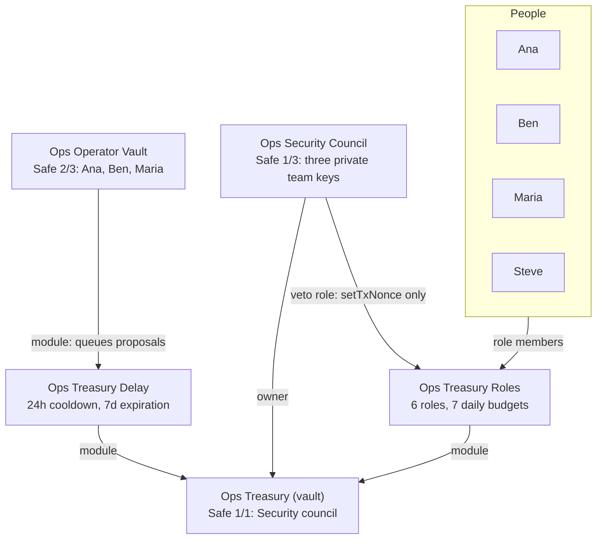

# Ops Treasury Constellation

A small ETH treasury on Ethereum, run by four people: Ana, Ben, Maria and Steve.
The design goal: a leaked key must not cause economic damage. Day-to-day work
runs through six narrow roles. Each role can only move value inside the vault,
or pay three whitelisted receivers. Each value-moving step has a budget of
0.05 ETH worth per day.

The wiring follows the [sim org constellation](https://github.com/jomoormann/zodiac-sim-org-constellation):
an Operator Vault proposes through a 24h Delay, and a Security council controlled by the Zodiac team can veto.
It is built from the [constellation template](https://github.com/gnosisguild/zodiac-constellation-template)
on `@zodiaceco/sdk` 2.4.

> **Status: placeholders.** The members, Zodiac team keys, payroll receivers and workspace
> are placeholders. `bun push` refuses to run until you replace them. See
> [Before you push](#before-you-push).

## Structure



| Node             | Label in the app       | Setup                                                                           |
| ---------------- | ---------------------- | ------------------------------------------------------------------------------- |
| Operator Vault   | `Ops Operator Vault`   | Safe, 2/3: Ana, Ben, Maria                                                      |
| Security council | `Ops Security Council` | Safe, 1/3: three separate Zodiac team keys                                      |
| Treasury (vault) | `Ops Treasury`         | Safe, 1/1: Security council. Roles and Delay are its modules |
| Roles Modifier   | `Ops Treasury Roles`   | owner = avatar = target = treasury                                              |
| Delay Modifier   | `Ops Treasury Delay`   | owner = avatar = target = treasury. Operator Vault is its only module           |

Ana, Ben, Maria and Steve are the four member keys. The operator vault uses Ana, Ben and Maria. The Security council is controlled by the Zodiac team and uses three separate private keys. `members.ts` rejects any overlap between member and team keys.

## Governance

The treasury is **1/1 owned by the Security council**. The council is a
**1/3 Safe controlled by the Zodiac team**, with three separate private keys.
The Operator Vault is not a treasury owner; it operates through the 24-hour Delay.

- **Operator changes:** two of Ana, Ben and Maria queue a treasury transaction
  through the Delay. It becomes executable after 24 hours unless vetoed.
- **Veto:** any one Zodiac team owner can skip queued transactions through the
  council's `veto` role.
- **Immediate changes and emergencies:** any one private team owner can sign
  through the council to execute an immediate treasury transaction.

A leaked member key retains only its assigned permissions and daily budgets.
Two leaked operator keys can queue arbitrary treasury transactions, subject to
the delay and council veto. A leaked council key gives full treasury control,
so the team keys are kept apart from the member keys.

## Roles

| Role           | Member           | Allows                                                                                                                                    | Budget per day                                 |
| -------------- | ---------------- | ----------------------------------------------------------------------------------------------------------------------------------------- | ---------------------------------------------- |
| `payroll`      | Ana              | `USDC.transfer` to three whitelisted receivers                                                                                            | 133 USDC, shared by the three                  |
| `swap`         | Ben              | Wrap and unwrap ETH. CoW orders that sell WETH, USDC or USDT for ETH, WETH, USDC or USDT. Receiver = vault, fee = 0, ERC-20 balances only | 0.05 WETH, 133 USDC, 133 USDT (per sell token) |
| `lido_staking` | Maria            | `stETH.submit`. Withdrawal requests owned by the vault. Claims that pay the vault                                                         | 0.05 ETH                                       |
| `aave_wsteth`  | Maria            | Wrap and unwrap stETH. Supply wstETH to Aave v3 Core for the vault. Withdraw to the vault. No borrow                                      | 0.0401 wstETH (0.05 ETH worth)                 |
| `morpho_usdc`  | Steve            | Deposit USDC into Steakhouse Prime USDC for the vault. Withdraw and redeem to the vault                                                   | 133 USDC                                       |
| `veto`         | Security council | `setTxNonce` on the Delay                                                                                                                 | none                                           |

Every approval names one spender: the CoW vault relayer, wstETH, the Aave
pool, the Lido withdrawal queue or the Morpho vault. Each of these pulls only
from the account that calls it, and only the vault calls them.

Not allowed anywhere: `transferFrom`, approvals to other spenders, `borrow`,
`claimWithdrawalsTo`, withdrawal NFT transfers, aToken or vault-share
transfers, Morpho `mint`, `multicall`, `permit` and `forceDeallocate`, and
plain ETH transfers.

Budgets meter the step that moves value into a position or out of the vault.
Value-neutral steps (wrap, unwrap) and returns to the vault (withdraw, redeem,
claim) have no budget. A budget there protects nothing and slows down an
emergency exit.

### Daily budgets

Roles v2 meters in token units, so 0.05 ETH is converted once, in
`constellation/allowances/index.ts`. Prices on 2026-09-29, block 26,084,674:

- ETH/USD 2,675.30 (Chainlink ETH/USD). 0.05 ETH = 133 USDC or USDT.
- 1.245174 stETH per wstETH. 0.05 ETH = 0.0401 wstETH.

To re-price, change `ETH_USD` or `STETH_PER_WSTETH` and push. Budgets do not
roll over. The planned deposit is about $1,000 in ETH (about 0.374 ETH), so one
day's budget is about 13% of the treasury per action.

## Residual risks

These remain with a leaked role key. All of them are capped by the daily budgets.

- **Swap price.** Roles v2 cannot check a price. A leaked `swap` key can sign
  an order with a bad limit price. CoW's solver auction sets the actual fill,
  so a fill far below market is unlikely. The exposure is at most one day's
  sell budget per token (about $400 across the three).
- **Swap metadata.** `appData` is not pinned, because the CoW interface writes
  a new one for each order. It can name a partner fee. That fee is also capped
  by the sell budget.
- **Payroll.** A leaked `payroll` key can pay up to 133 USDC per day early, to
  the three known receivers.
- **Nuisance.** A leaked key can cancel orders, withdraw positions back to the
  vault, or request Lido withdrawals. This costs yield, not principal.

Protocol risk (Lido, Aave, Morpho curator, CoW) is not a key risk and stays as it is.

## Contracts

All on Ethereum mainnet, checked on chain on 2026-09-29.

| Name in `zodiac.config.ts`     | Address                                      | Notes                                                                                                                              |
| ------------------------------ | -------------------------------------------- | ---------------------------------------------------------------------------------------------------------------------------------- |
| `weth`                         | `0xC02aaA39b223FE8D0A0e5C4F27eAD9083C756Cc2` |                                                                                                                                    |
| `usdc`                         | `0xA0b86991c6218b36c1d19D4a2e9Eb0cE3606eB48` |                                                                                                                                    |
| `usdt`                         | `0xdAC17F958D2ee523a2206206994597C13D831ec7` |                                                                                                                                    |
| `cowswap.order_signer`         | `0x23dA9AdE38E4477b23770DeD512fD37b12381FAB` | Gnosis Guild CowswapOrderSigner, verified source. Pilot routes CoW Swap presignatures through it automatically                     |
| `cowswap.vault_relayer`        | `0xC92E8bdf79f0507f65a392b0ab4667716BFE0110` | GPv2VaultRelayer (approval target only)                                                                                            |
| `lido.steth`                   | `0xae7ab96520DE3A18E5e111B5EaAb095312D7fE84` |                                                                                                                                    |
| `lido.wsteth`                  | `0x7f39C581F595B53c5cb19bD0b3f8dA6c935E2Ca0` |                                                                                                                                    |
| `lido.withdrawal_queue`        | `0x889edC2eDab5f40e902b864aD4d7AdE8E412F9B1` | WithdrawalQueueERC721                                                                                                              |
| `aave_v3.core_pool`            | `0x87870Bca3F3fD6335C3F4ce8392D69350B4fA4E2` | Aave v3 **Ethereum Core** market ("Aave Ethereum Market"). aToken aEthwstETH `0x0B925eD1…9E9371`. wstETH supply 791k of a 950k cap |
| `morpho.steakhouse_prime_usdc` | `0xbeef088055857739C12CD3765F20b7679Def0f51` | Steakhouse Prime USDC, a Morpho Vault V2, curator Steakhouse. $122M, the largest listed USDC vault. No deposit gates               |

Aave: Aave v3 does not list stETH, only wstETH, so the role wraps first. The
Core market is Aave's main Ethereum market. The Prime market (`0x4e0339…B58B1`,
wstETH 58k of an 80k cap) also works. To switch, change `core_pool`.

Morpho: two unlisted USDC vaults are larger (Adpend USDC, 1337 USDC). They are
not in the Morpho app, so this constellation uses the largest listed vault.

## Verification

1. **Zodiac compiles the spec.** Zodiac's resolve endpoint (read-only, it stores
   nothing) compiles all six roles and predicts every address. The compiled
   conditions match the tables above. The `veto` role targets the predicted
   Delay and names the predicted team as its member.
2. **Leak test on a mainnet fork: 74 of 74 checks pass** (block 26,084,781).
   `test/leak-test.ts` deploys a Safe, the Roles Modifier and the Delay on a
   fork. It loads the permissions exactly as Zodiac compiles them, then acts as
   each member. It runs 29 normal steps and 44 attacks. A refusal counts only
   if the Roles Modifier itself refused it. The test also queues a drain through
   the Delay, vetoes it as the team, and shows it cannot execute after 24h.
   It does not rehearse the signatures of nested Safe owners, such as the
   council signing for the treasury.

Run it again after you change anything:

```bash
anvil --fork-url https://ethereum-rpc.publicnode.com
bun test:leaks
```

`hardhat node --fork <rpc>` also works. Set `FORK_RPC` if the node is not on
`http://127.0.0.1:8545`.

## Before you push

1. Replace every placeholder in `constellation/members.ts`. Use plain addresses
   or `eth.user["Full Name"]` for org users.
2. Set the workspace in `constellation/context.ts`. It now names the Zodiac Demo
   Org's "Default workspace".
3. Check the signer and role assignments. They are placeholder choices.
4. Run `bun test:leaks` again.

Then:

```bash
bun pull
bun push
```

`push` stores a revision only. Nothing is on chain until someone deploys it
from the review page. New addresses derive from the personal Safe of the
person who deploys. After the deployment, fund the treasury with about
0.374 ETH, run `bun pull` again, and refer to the nodes by label.

## Known issues

These were found while building this constellation. Both are in Zodiac, not
in this repo.

1. **Node references in permissions must be lowercase.** The `veto` role names
   the Delay by its node reference. Zodiac lowercases that reference when it
   compiles the permission, but matches references case-sensitively. A
   reference such as `$treasuryDelay` gives a 500. The export names in
   `constellation/index.ts` are therefore lowercase (`treasury_delay`). Keep
   them lowercase until
   [gnosisguild/zodiac-os#5390](https://github.com/gnosisguild/zodiac-os/pull/5390)
   is live.
2. **`etherWithinAllowance` needs an encoded key.** The allow kit of
   `@zodiaceco/sdk` 2.4 sends this key as written. A plain label gives a 500.
   `lido_staking` encodes it with `encodeKey`. `c.withinAllowance` has no such
   problem. Fixed in
   [gnosisguild/zodiac-sdk#72](https://github.com/gnosisguild/zodiac-sdk/pull/72);
   after that release the plain label works too.

Nonces: new Roles and Delay addresses derive from the deployer's setup Safe
and the nonce only. The predicted addresses are empty on Ethereum. If the same
person already deployed a Roles or Delay with nonce 0 on Ethereum through a
constellation, increase the nonce.

## Workflow

```bash
bun install
bun pull          # org users, accounts, contract ABIs (uses ZODIAC_API_KEY from .env)
bun test:leaks    # leak test against a local mainnet fork
bun push          # stores the next revision and opens the review page
```

## License

LGPL-3.0-only, the same as the template.
